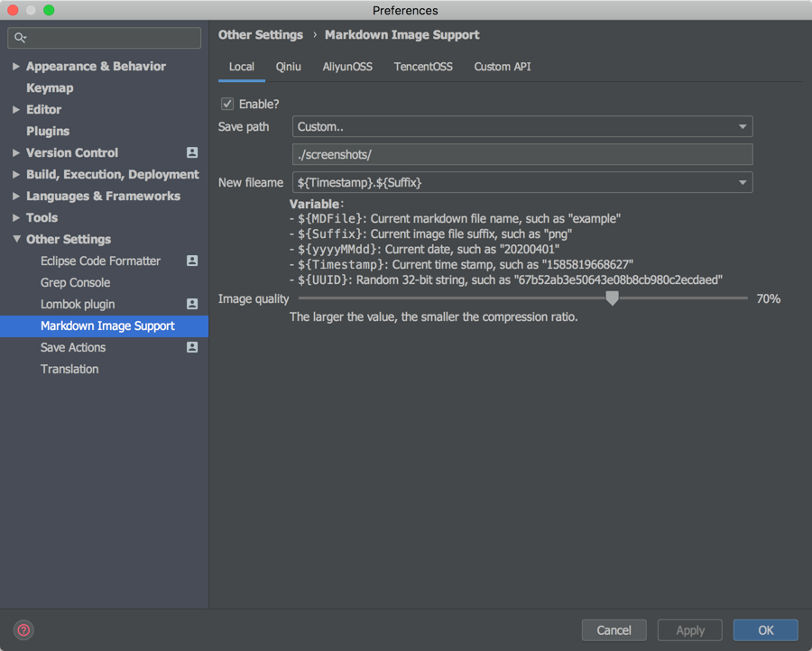
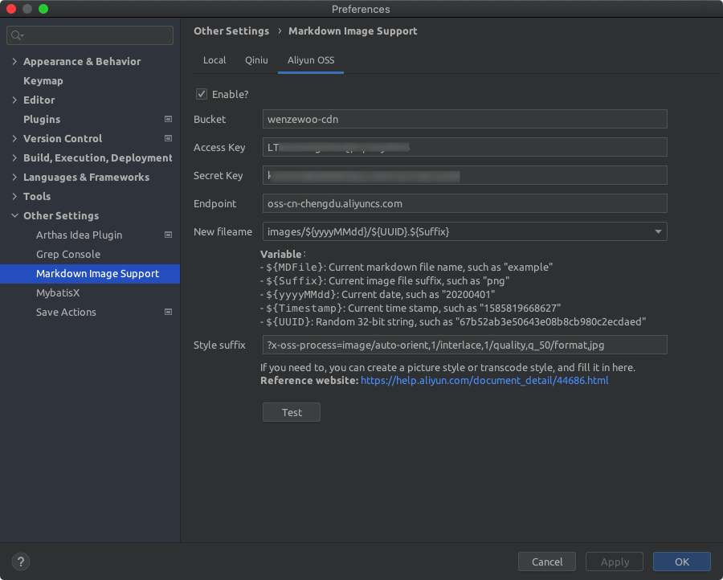
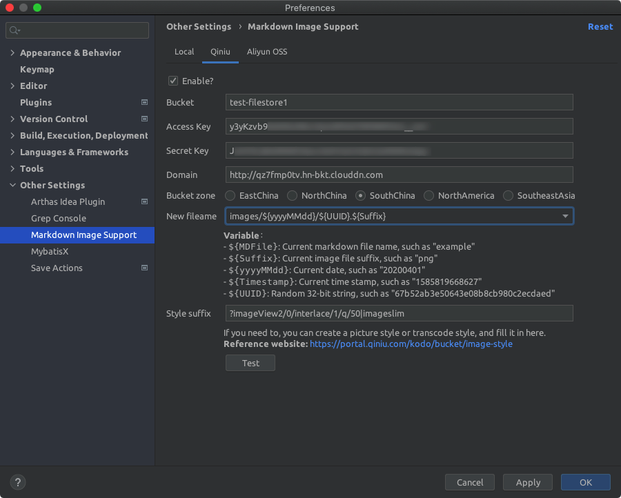
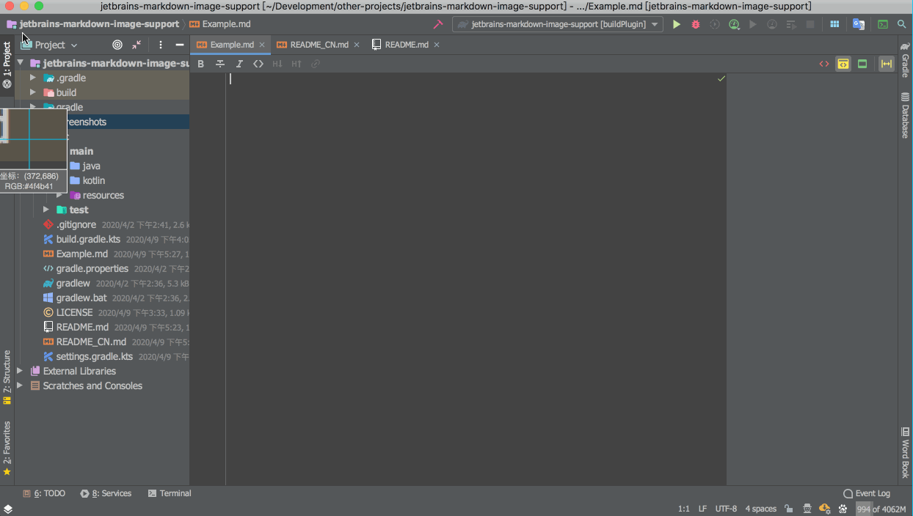
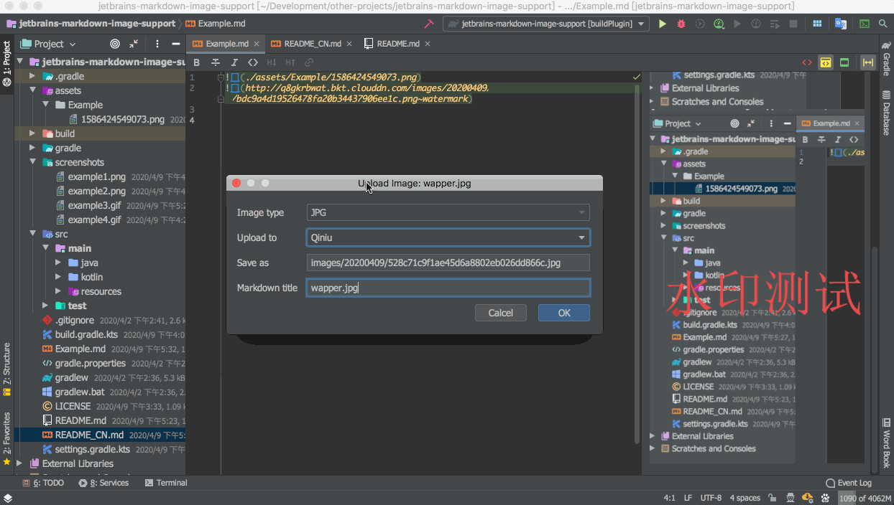
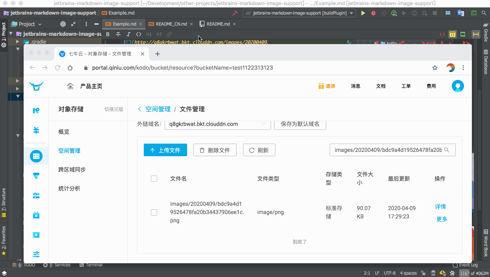

# Jetbrains Markdown Image Support

> Markdown编辑器一键上传图片支持，适用于Jetbrains系列的常见产品。

[English](./README.md) | [提交Issues](https://github.com/wenzewoo/jetbrains-markdown-image-support/issues)

## 特性

- 多种存储支持，如本地/七牛/阿里云OSS/腾讯OSS等。
- 自定义文件名命名策略，并提供多种预设方案。
- 提供图片压缩功能，按照设置的压缩率压缩图片。
- 直接从粘贴图片到编辑器，自动上传图片并转换为Markdown标签。
- 直接复制一个或者多个图片文件到编辑器，自动上传图片并转换为Markdown标签。
- 通过Alt+Enter快捷键，智能删除图片，删除Markdown标记的同时，移除对应存储中的源文件。-

## 安装

Preferences -> Plugins -> Marketplace， 搜索 "Markdown Image Support"

## 预览

#### 设置界面

#### 直接粘贴图片，自由选择已开启的存储

#### 复制多个图片文件，自由选择已开启的存储

#### 使用 Alt+Enter 删除图片源文件

